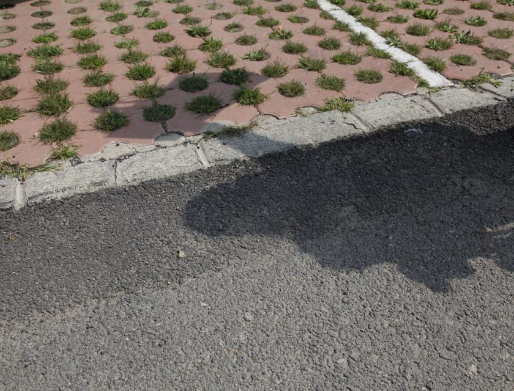
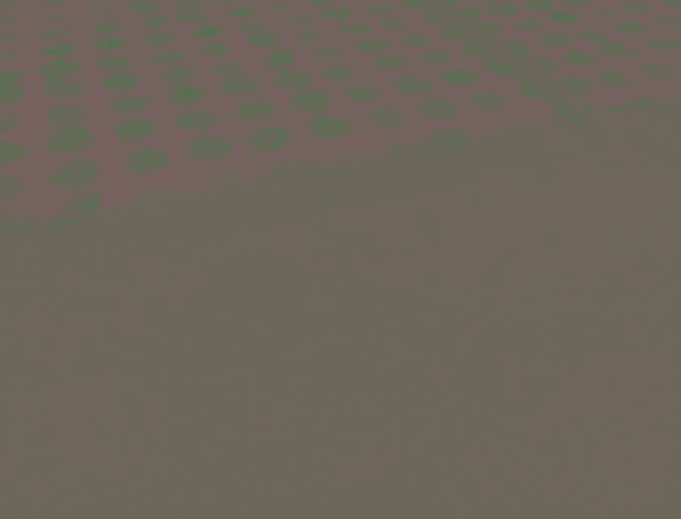
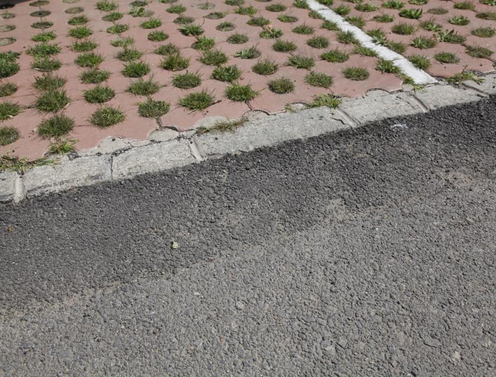
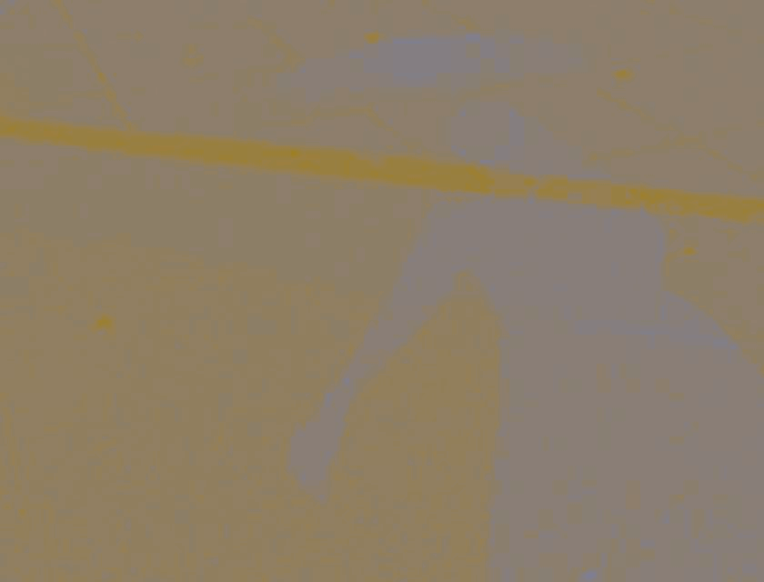
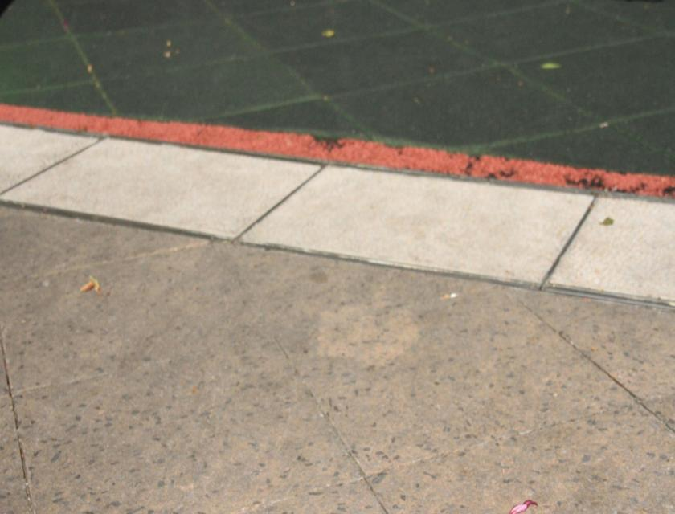

# FASR-Net 

## The code is being updated gradually.

### Shadow_Brightness-Chromaticity_demo

## 第一行图片

## 第二行图片

#### Datasets

1. SRD 
2. AISTD|ISTD+ 

### Evaluation

#### Table 1: PSNR/RMSE/SSIM/LPIPS Results on AISTD Dataset
| Learning | Method | Shadow Region (S) PSNR $\uparrow$ | Shadow Region (S) RMSE $\downarrow$ | Shadow Region (S) SSIM $\uparrow$ | Shadow-Free Region (NS) PSNR $\uparrow$ | Shadow-Free Region (NS) RMSE $\downarrow$ | Shadow-Free Region (NS) SSIM $\uparrow$ | All Image PSNR $\uparrow$ | All Image RMSE $\downarrow$ | All Image SSIM $\uparrow$ | All Image LPIPS $\downarrow$ |
| --- | --- | --- | --- | --- | --- | --- | --- | --- | --- | --- | --- |
| Supervised | G2R-ShadowNet | 26.24 | 15.31 | 0.962 | 32.46 | 3.43 | 0.946 | 22.58 | 5.30 | 0.876 | 0.140 |
| Supervised | Auto | 31.00 | 9.44 | 0.971 | 29.32 | 4.37 | 0.841 | 24.14 | 5.17 | 0.768 | 0.174 |
| Supervised | Param+M+D-Net | 30.99 | 10.50 | **0.985** | 34.50 | 3.74 | 0.976 | 26.58 | 4.81 | **0.942** | 0.062 |
| Unsupervised | Mask-ShadowGAN | 29.37 | 12.50 | 0.901 | 31.65 | 4.00 | 0.943 | 24.57 | 5.30 | 0.915 | 0.095 |
| Unsupervised | S3R-Net | - | 12.16 | - | - | 6.38 | - | - | 7.12 | - | - |
| Unsupervised | LG-ShadowNet | 30.32 | 10.35 | 0.982 | 32.53 | 4.03 | 0.973 | 25.53 | 5.03 | 0.928 | 0.103 |
| Unsupervised | DC-ShadowNet | 31.06 | 10.30 | 0.978 | 27.03 | 3.50 | 0.971 | 25.03 | 4.60 | 0.921 | 0.170 |
| Unsupervised | **FASR-Net(ours)** | **31.89** | **8.61** | 0.982 | **34.57** | **2.84** | **0.978** | **27.58** | **3.75** | 0.934 | **0.055** | 
#### Table 2: RMSE Results on SRD Dataset
| Learning | Method | S | NS | All |
| --- | --- | --- | --- | --- |
| SL | G2R-ShadowNet | 11.78 | 4.84 | 6.64 |
| SL | DSC | 8.62 | 4.41 | 5.71 |
| SL | BMNet | 6.61 | 3.61 | 4.46 |
| SL | Inpaint4Shadow | 6.09 | 2.97 | 3.83 |
| UL | Mask-ShadowGAN | 11.46 | 4.29 | 6.40 |
| UL | DC-ShadowNet | 7.73 | 3.60 | 4.77 |
| UL | FASR-Net(ours) | 7.45 | 3.49 | 4.62 |

#### Table 3: Ablation Study Results on AISTD Dataset
| Method | PSNR $\uparrow$ | RMSE $\downarrow$ | SSIM $\uparrow$ | LPIPS $\downarrow$ |
| --- | --- | --- | --- | --- |
| FASR-Net | **31.89** | **8.61** | **0.973** | **0.033** |
| w/o $\mathcal{L}_{Align}$ | 30.82 | 9.72 | 0.973 | 0.035 |
| w/o $\mathcal{L}_{brightness-ch}$ | 30.21 | 10.33 | 0.910 | 0.037 |
| w/o $\mathcal{L}_{frequency}$ | 29.74 | 10.42 | 0.971 | 0.093 |
